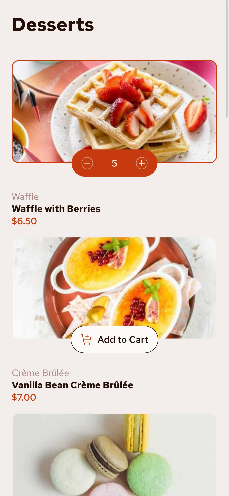

# Frontend Mentor - Product list with cart solution

This is a solution to the [Product list with cart challenge on Frontend Mentor](https://www.frontendmentor.io/challenges/product-list-with-cart-5MmqLVAp_d). Frontend Mentor challenges help you improve your coding skills by building realistic projects.

## Table of contents

- [Overview](#overview)
  - [The challenge](#the-challenge)
  - [Screenshot](#screenshot)
  - [Links](#links)
- [My process](#my-process)
  - [Built with](#built-with)
  - [What I learned](#what-i-learned)
- [Author](#author)

## Overview

### The challenge

Users should be able to:

- Add items to the cart and remove them
- Increase/decrease the number of items in the cart
- See an order confirmation modal when they click "Confirm Order"
- Reset their selections when they click "Start New Order"
- View the optimal layout for the interface depending on their device's screen size
- See hover and focus states for all interactive elements on the page

### Screenshot

#### Desktop


#### Mobile

<p>
    
    
    
</p>

### Links

- Live Site URL: [https://julianngabrieldev.github.io/fm-product-list-with-cart/](https://julianngabrieldev.github.io/fm-product-list-with-cart/)

## My process

### Built with

- Semantic HTML5 markup
- CSS custom properties
- Flexbox
- CSS Grid
- Mobile-first workflow
- Asynchronous functions in JS
- Fetch API
- Event listeners
- JSON
- DOM manipulation

### What I learned

- How to work with asynchronous code
- Arrays and their methods for example forEach

```js
async function fetchProductData() {
	try {
		const response = await fetch("/data.json");
		if (!response.ok) {
			throw new Error("Network response was not ok");
		}
		const data = await response.json();

		initData(data);
	} catch (error) {
		console.log(`Error loading product data: ${error}`);
	}
}
fetchProductData();
```

## Author
- Julián Alejandro Gabriel Isidro
- Frontend Mentor - [@juliannGabrielDev](https://www.frontendmentor.io/profile/juliannGabrielDev)